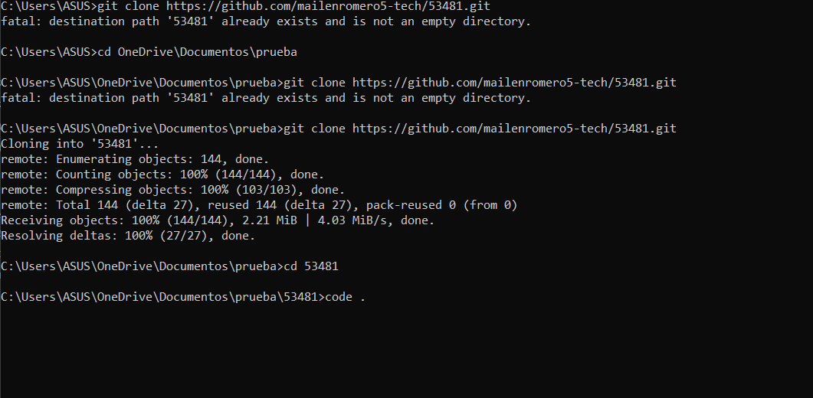
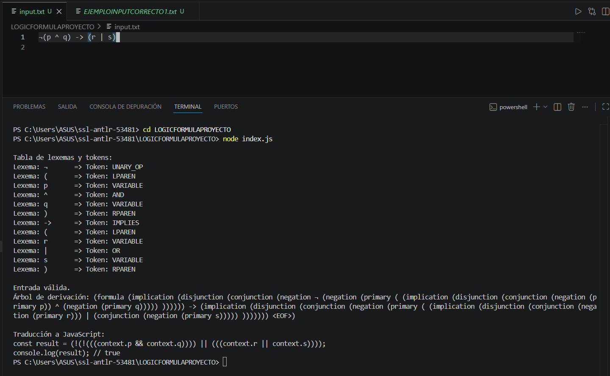
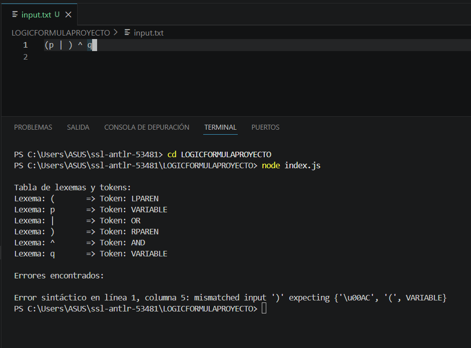

# Analizador ANTLR4 y JavaScript - Legajo 53481

# Tema 

25914_15

# Descripción
Este  proyecto que he realizado,  implementa un analizador léxico y sintáctico utilizando ANTLR4 y JavaScript para el lenguaje de fórmulas lógicas propuesto en la consigna.

El analizador permite:
- Realizar análisis léxico y sintáctico.
- Detectar errores de sintaxis.
- Generar una tabla de lexemas y tokens.
- Construir el árbol de derivación.
- Traducir expresiones lógicas a JavaScript.

# Aclaraciones IMPORTANTES
- Uso de | en lugar de v
En la gramática se utilizó el símbolo | para la disyunción lógica porque ANTLR interpretaba la letra v como parte de una variable.

- Uso de '^' para la conjunción

- Uso de '->' para la implicación

-Uso de '¬' para la negación

# Configuración Inicial 

Pasos para ejecutarlo: 
1. Abrimos GITHUB
2. Clonamos el repositorio dentro de una carpeta cualquira (en mi caso sera en una llamada "prueba"):

git clone https://github.com/mailenromero5-tech/53481.git

3. Luego nos tenemos que dirigir al directorio lo cual escribimos: 

cd 53481

4. Abrimos VS Code para trabajar con el proyecto, para ello colocamos: 

code . 

De otra manera, podemos hacerlo desde la ventana de comandos (cmd) y hacemos el mismo procedimiento

# Uso del proyecto 
Una vez configurado el proyecto, podemos ejecutar el analizador de la siguiente forma:

1. Elegir un ejemplo

2. Copiar el contenido del ejemplo que deseamos probar dentro del archivo `input.txt`, en este caso elegí el ejemplo correcto 1.

3. Luego de colocar el ejemplo ejecutamos el programa desde la Terminal. 

# ACLARACIÓN

En la terminal debemos ingresar a la carpeta lo cual para ello escribimos:

cd LOGICFORMULAPROYECTO

Y luego: 

node index.js

El resultado en un ejemplo corrcto es:

Caso contrario, si probamos el ejemplo incorrecto 1 nos mostrará la línea del error, el token problemático y la descripción del error detectado y la tabla de lexemas y tokens.

