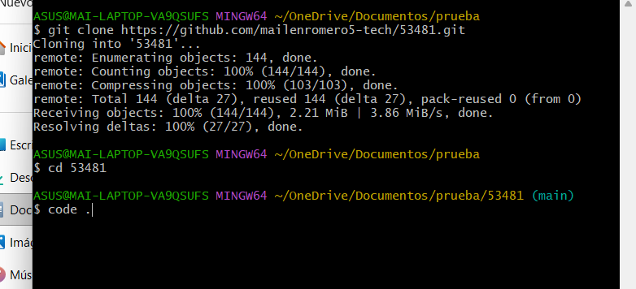
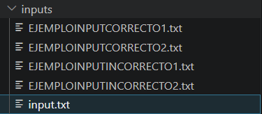
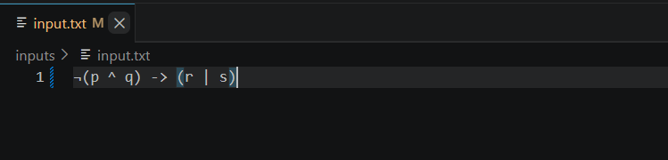
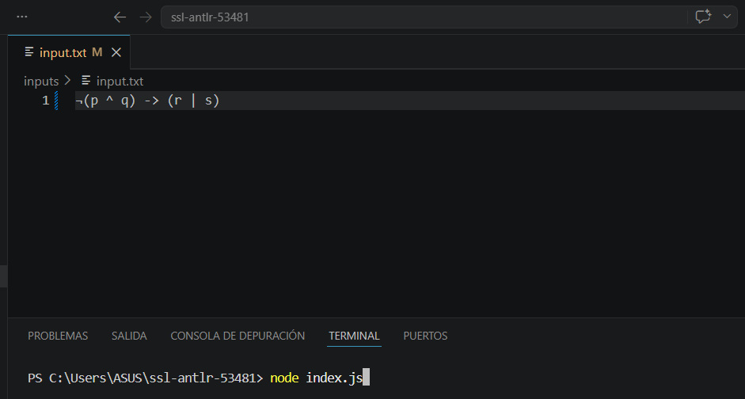
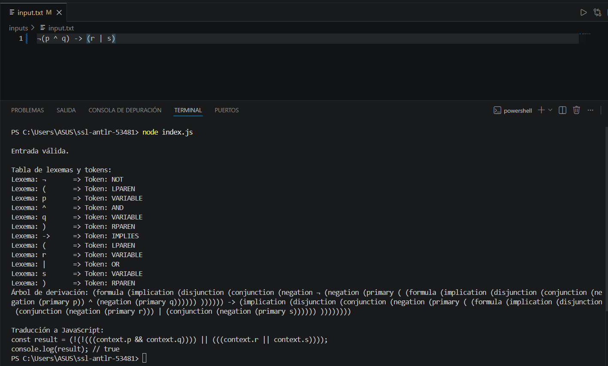
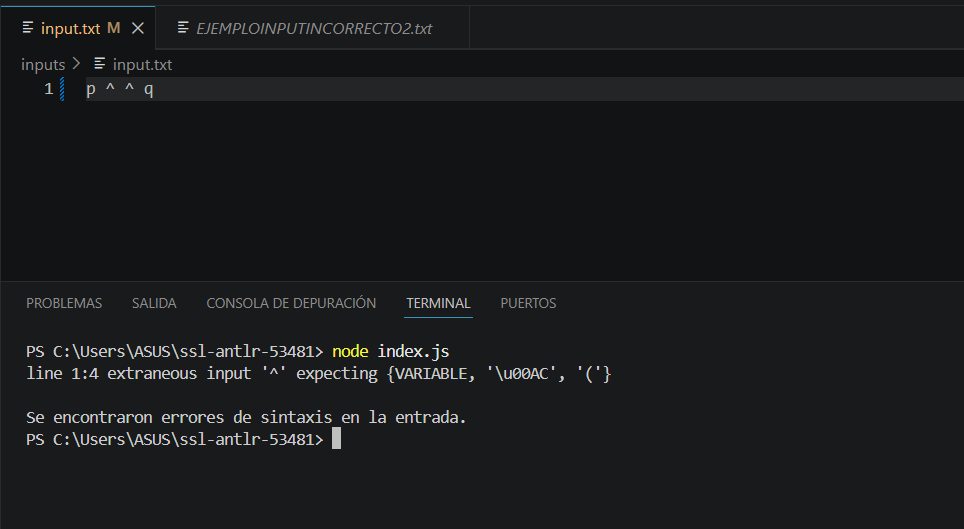

# Analizador ANTLR4 y JavaScript - Legajo 53481

# Tema 

25914_15

# Descripción
Este  proyecto que he realizado,  implementa un analizador léxico y sintáctico utilizando ANTLR4 y JavaScript para el lenguaje de fórmulas lógicas propuesto en la consigna.

El analizador permite:
- Realizar análisis léxico y sintáctico.
- Detectar errores de sintaxis.
- Generar una tabla de lexemas y tokens.
- Construir el árbol de derivación.
- Traducir expresiones lógicas a JavaScript.

# Contenido del repositorio

- generated/: código generado por ANTLR4
- inputs/: ejemplos válidos e inválidos
- LogicFormula.g4: gramática principal
- index.js: programa principal
- README.md: instrucciones de ejecución

# Características de la Gramática

- Soporta expresiones lógicas con implicación (`->`).
- Permite disyunciones mediante el operador (`|`).
- Permite conjunciones mediante el operador (`^`).
- Incluye negación lógica utilizando (`¬`).
- Implementa precedencia y asociatividad de operadores.
- Gramática implementada en ANTLR4.
- Traduce expresiones lógicas a código JavaScript.

# Requisitos

Para ejecutar el proyecto es necesario tener instalado:

- Node.js
- Java Runtime Environment (JRE)
- Visual Studio Code 
- Git 
1. Node.js (v16+) desde la página oficial https://nodejs.org/es , la versión que use fue: v24.15.0

2. Java Runtime (JRE) para ANTLR4, la versión que use fue: "java version "25" 2026-03-17"  

3. Descargar Visual Studio Code https://code.visualstudio.com/ , la versión que use fue: 1.119.0
8b640eef5a6c6089c029249d48efa5c99adf7d51
x64

4. Descargar e instalar Git desde la página oficial https://git-scm.com/downloads , la versión que use fue: git version 2.54.0.windows.1

# Configuración Inicial 
Estas instrucciones se pueden ejecutar en cualquiera de los siguientes entornos de línea de comandos:

- Terminal de Linux o macOS (Bash, Zsh, etc.)
- Windows PowerShell
- Símbolo del sistema (CMD) en Windows
- Terminal integrada de Visual Studio Code
- GitBash

Pasos para ejecutarlo: 
1. Abrimos GITHUB
2. Clonamos el repositorio dentro de una carpeta cualquira (en mi caso sera en una llamada "prueba"):

git clone https://github.com/mailenromero5-tech/53481.git
3. Luego nos tenemos que dirigir al directorio lo cual escribimos: 

cd 53481

4. Abrimos VS Code para trabajar con el proyecto, para ello colocamos: 

code . 

De otra manera, podemos hacerlo desde la ventana de comandos (cmd) y hacemos el mismo procedimiento

# Uso del proyecto 
Una vez configurado el proyecto, podemos ejecutar el analizador de la siguiente forma:
1. Asegurarnos de tener los archivos de entrada en la carpeta inputs/. 

2. Dentro del inputs/input.txt , podemos probar los ejemplos que tenemos (2 correctos, 2 incorrectos)

3. Luego de colocar el ejemplo deseado en el inputs/input.txt ejecutamos el programa con Node.js desde la terminal de VS code (Ir a Terminal > Nueva terminal) y dentro de ella colocamos node index.js

El resultado en un ejemplo corrcto es:

Caso contrario, se muestra línea del error, token problemático y descripción del error detectado. 

Ejemplo de muestra: (analizando el inputs/EJEMPLOINCORRECTO2.txt)

# Autor
Mailén Romero
Legajo: 53481 

